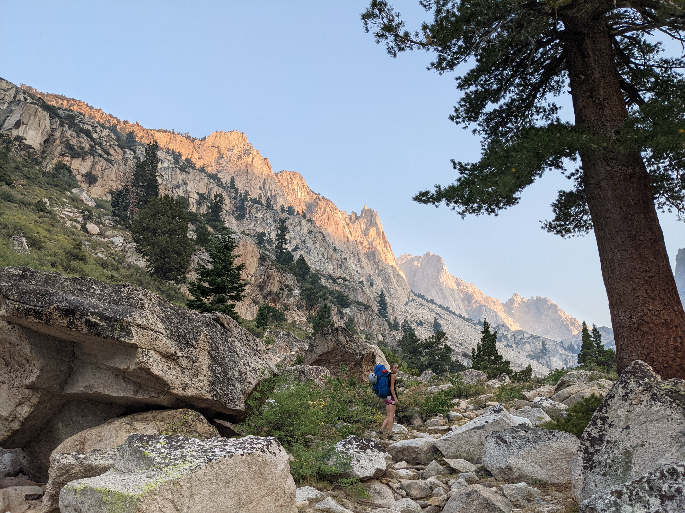
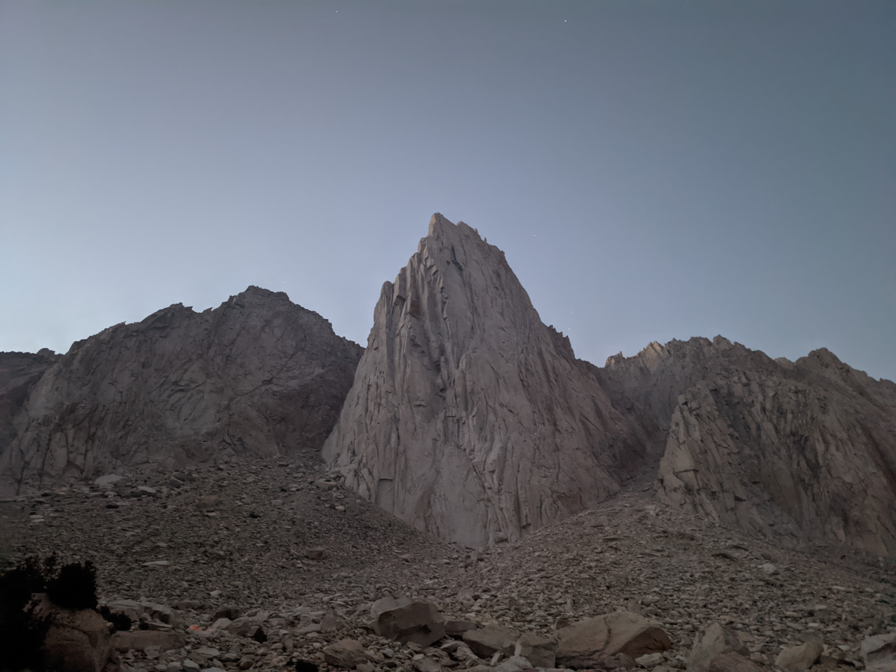
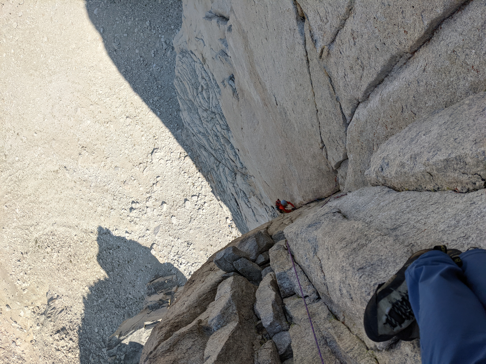
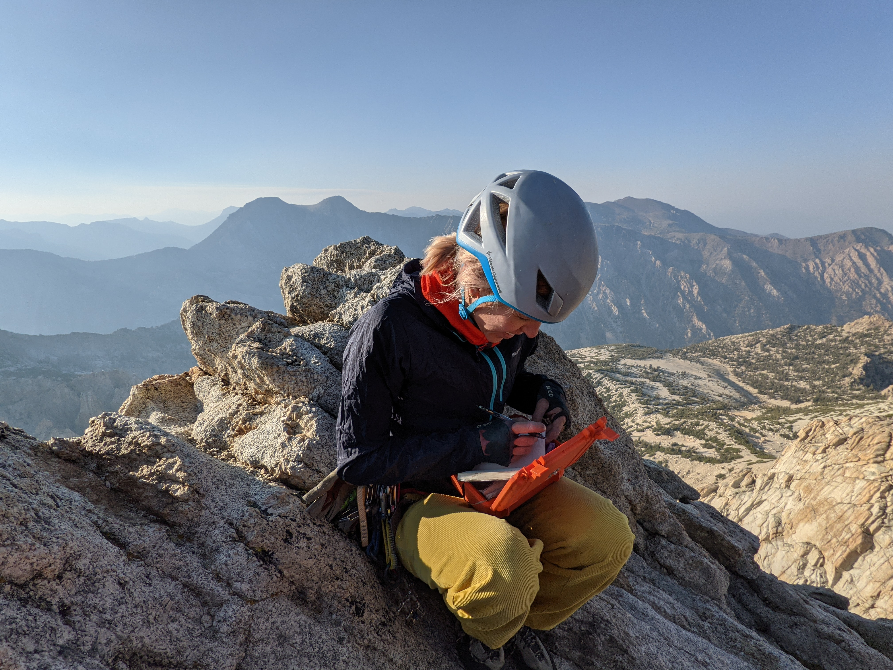
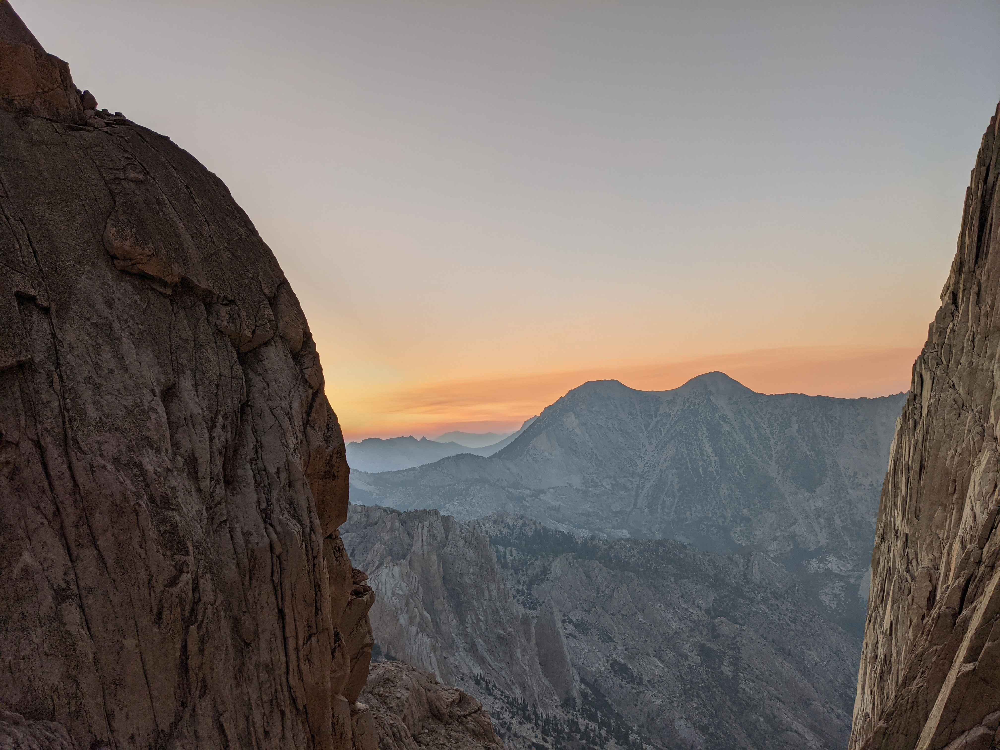

# Trip Report: Incredible Hulk (Red Dihedral)

### Summary
 * **Date:** August 28, 2021
 * **Team:** Sergey & Aliona
 * **Route:** Red Dihedral (5.10b)
 * **Style:** Camp-to-Camp
 * **Total Time:** 12h 46m
 * **Approach:** 3h 2m, 2,474ft ([Strava](https://www.strava.com/activities/5873592387))
 * [Strava (Climb)](https://www.strava.com/activities/5873602907)
 * [Strava (Hike Out)](https://www.strava.com/activities/5874630969)
 * [**GPX**](./Incredible_Hulk_Red_Dihedral.gpx)

---

## 1. Hike In & Approach to the Hulk

We began hiking the day before from the Twin Lakes trailhead near Bridgeport. Once we left the good trail, navigating over the large boulder field became a bit slower and non-obvious. The hike in took ~3 hours, gaining ~2,500 feet of elevation over about 4.4 miles.

Next morning we woke up early to start the approach to the base of the route.

We geared up at the base of the face and started climbing at **8AM**.

---

## 2. Climbing the Red Dihedral (5.10b)

The climbing was generally pretty chill, beginning with moderate crack and face pitches to reach the corner system. Once inside the dihedral, the pitches offered sustained crack climbing and stemming. 

The crux pitch (Pitch 5, 5.10b) was the main exception to the chill climbing, requiring sustained laybacking and stemming with a committing move at the end of the pitch. Above the main corner, the route continues through crack systems on the upper headwall. Near the top of the route, we passed through the "keyhole" feature. Sergey was a bit worried about squeezing through the keyhole, but it turned out not to be that small and went fine.

---

## 3. Summit & Descent

We topped out on the summit of the Incredible Hulk at **6:00 PM**. The summit views looking down at Barney Lake and the surrounding wilderness were clear, and Aliona signed the orange summit register.

When we reached the top, I thought we were doing pretty well on time and briefly considered packing up camp to hike all the way out to the trailhead that evening instead of camping another night. 

However, the descent took much longer than expected. Finding the way through the notch, negotiating the rappels, downclimbing, and scrambling back through the boulder field took us **2 hours and 45 minutes**. We didn't make it back to camp until **8:45 PM**, completing a **12-hour and 46-minute** camp-to-camp day, so we spent another night.

The following morning, we packed up camp and hiked the 4.4 miles back to the trailhead in 2 hours and 20 minutes.
