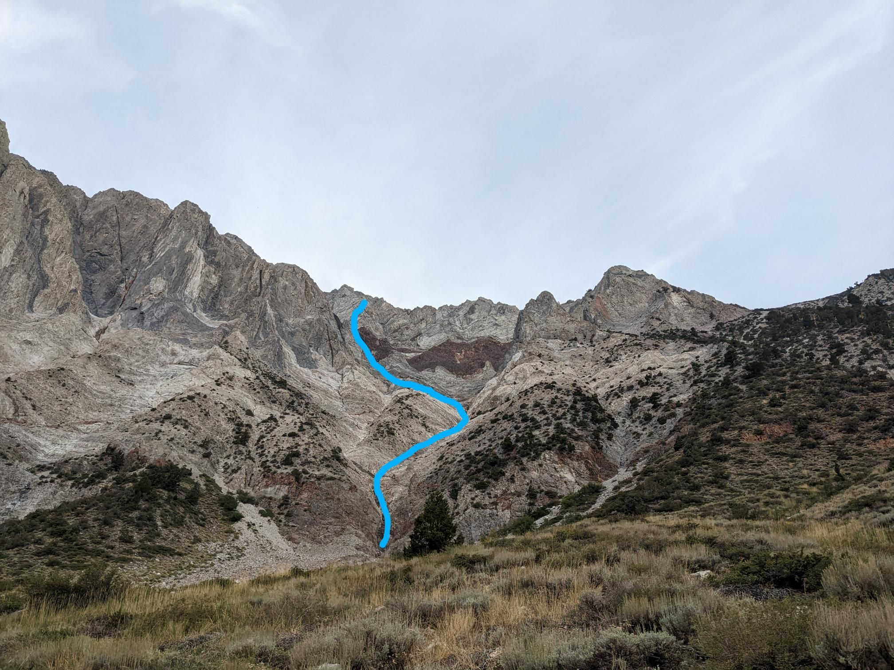
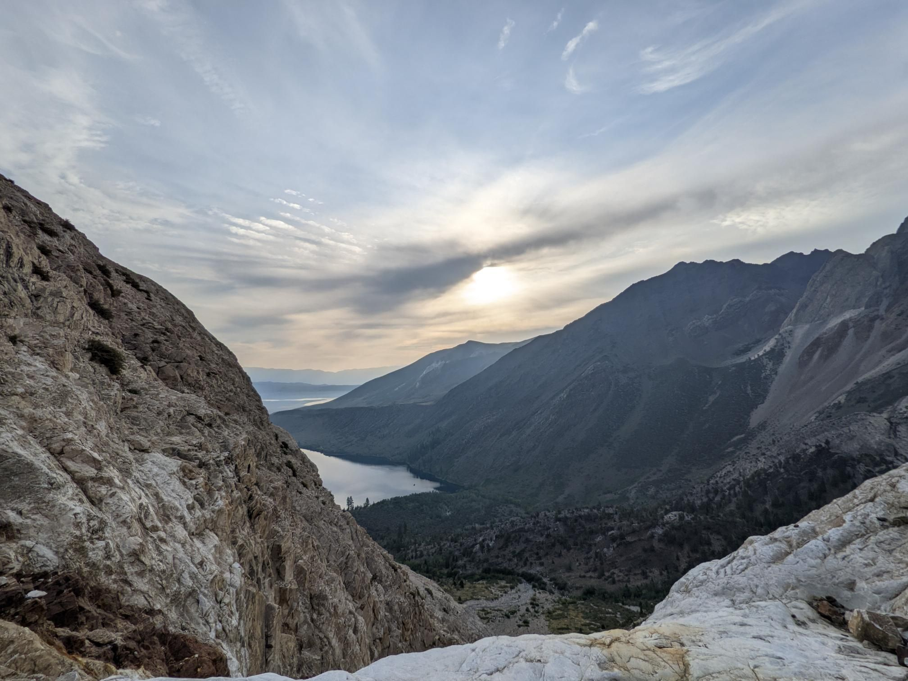
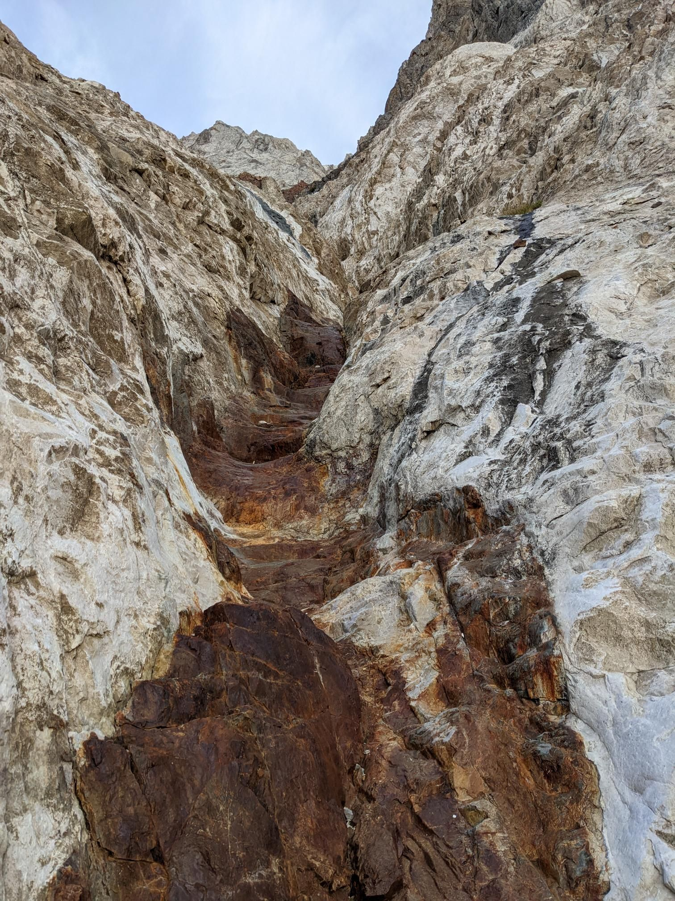

# Trip Report: Mt Laurel via NE Gully

### Summary
 * **Date:** September 10, 2022
 * **Team:** Sergey & Rulik
 * **Route:** NE Gully (Convict Lake Approach)
 * **Style:** Scramble / Day Hike
 * **Total Time:** 6h 0m
 * **Total Distance**: 10.92mi
 * **Total Elevation Gain**: 3,590ft
 * [Strava](https://www.strava.com/activities/7787099923)
 * [**GPX**](./Mt_Laurel_NE_gully.gpx)

---

## 1. The Approach from Convict Lake

We started our morning at the Convict Lake trailhead under crisp, clear September Sierra skies. Mt Laurel (11,812') and its neighbor Mt Morrison tower dramatically over the deep blue waters of Convict Lake, showing off their famous contorted metamorphic rock bands. 

The approach leads us past the lake and up into Laurel Canyon. We followed the rugged 4WD road winding up the canyon alongside Laurel Creek. The air was cool, but as soon as the sun hit the canyon walls, the temperature started rising. The trail was mostly straightforward but grew progressively steeper and looser as we climbed higher into the drainage, eventually positioning us directly beneath the massive northeast face of Mt Laurel.

---

## 2. Scrambling the NE Gully

Leaving the road behind, we entered the mouth of the NE Gully. The route is a classic Sierra scramble, characterized by a massive scree and talus gully that cuts directly up the mountain. 

The scrambling began on loose, sliding rock where every two steps forward felt like one step back. However, by seeking out solid ribs of rock along the margins of the gully, we found excellent, stable scrambling on third-class rock steps. The routefinding was simple—just keep heading up—but we had to remain vigilant about loose rock, especially when climbing close to each other. The gully narrowed as it got steeper, surrounded by striking red, orange, and grey metamorphic rock bands that made for a spectacular backdrop.

---

## 3. Summit Ridge & Breathtaking Views

After a final, grinding push up the top of the couloir, we topped out onto the summit ridge. From the notch, the final stretch to the summit was a pleasant, wind-blown walk along the wide ridge.

We reached the summit of Mt Laurel (11,812 ft) exactly 3.5 hours after setting out. The summit offers a spectacular, bird's-eye view looking directly down onto Convict Lake, with Crowley Lake and the vast Owens Valley stretching out to the east. After enjoying a quick lunch, signing the register, and snapping photos of the dramatic ridges, we began our descent. We plunged down the soft scree slopes on the west side of the ridge, linking back up with the Laurel Canyon road and completing the 10.9-mile loop back to the lake in exactly 6 hours.
