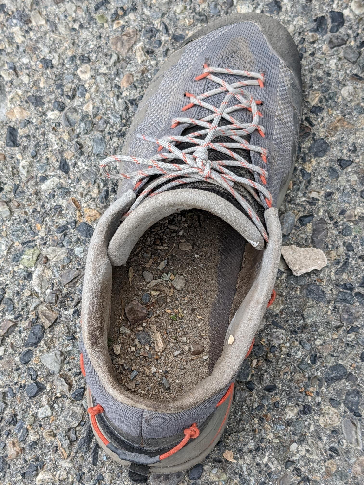

# Trip Report: Mt Laurel via NE Gully

### Summary
 * **Date:** September 10, 2022
 * **Team:** Sergey & Rulik
 * **Route:** NE Gully (Convict Lake Approach)
 * **Style:** Scramble / Day Hike
 * **Total Time:** 6h 0m
 * **Total Distance**: 10.92mi
 * **Total Elevation Gain**: 3,590ft
 * [Strava](https://www.strava.com/activities/7787099923)
 * [**GPX**](./Mt_Laurel_NE_gully.gpx)

---

## 1. The Approach & Dry Metamorphic Rock

We started our morning at the Convict Lake trailhead under crisp, clear September Sierra skies. Mt Laurel (11,812') and its neighbor Mt Morrison tower dramatically over the deep blue waters of Convict Lake, showing off their famous contorted metamorphic rock bands. 

The approach leads us past the lake and up into Laurel Canyon. We followed the rugged 4WD road winding up the canyon alongside Laurel Creek. The approach went smoothly and the route was completely dry, with no lingering snow or ice in the gully. The path was straightforward and brought us directly beneath the massive northeast face of Mt Laurel.

---

## 2. Scrambling the NE Gully

Leaving the road behind, we entered the mouth of the NE Gully. The route is a classic Sierra scramble, characterized by a massive scree and talus gully that cuts directly up the mountain. 

Contrary to some chossy reports, the rock felt remarkably solid for most of the climb. It was only as we got much closer to the summit ridge that the rock became looser and felt a little less solid. The start of the gully offered the hardest section of technical scrambling, but even then, it wasn't particularly difficult. We made quick, enjoyable progress climbing up the clean rock steps.

---

## 3. Summit Ridge & Sandy Descent

After topping out of the gully onto the summit ridge, we enjoyed the final ridge walk to the summit of Mt Laurel. The view from the top register was spectacular, looking directly down Convict Lake.

However, the real adventure of the day began on the descent. While the approach was pleasant, the descent was extremely sandy and somewhat bushwacky. Plunging down the steep, soft slopes felt like scree surfing, resulting in an incredible amount of sand finding its way into our gear. By the time we got back down, our approach shoes were completely filled to the brim with sand and small pebbles! After shaking out our shoes and navigating some thick trailside brush, we completed the 10.9-mile loop back to Convict Lake in exactly 6 hours.
