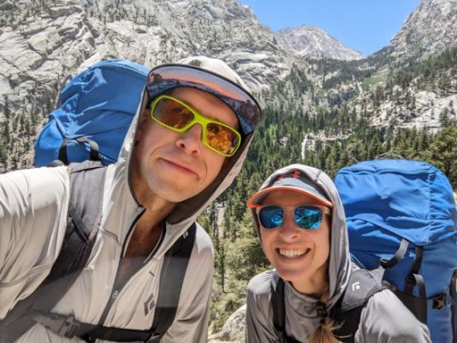
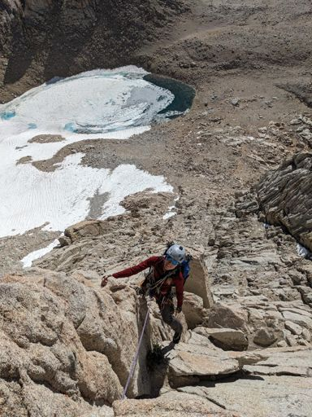

# Trip Report: Mt Whitney (East Buttress)
### Summary
 * **Date:** June 29–30, 2024
 * **Team:** Sergey & Aliona
 * **Route:** East Buttress (5.7)
 * **Style:** Backpack (Camp at Iceberg Lake)
 * **Total Time:** Day 1: 7:41, Day 2: 16:29
 * **Total Distance**: 16.5mi (Day 1: 7.22mi, Day 2: 9.3mi)
 * **Total Elevation Gain**: 6,875ft (Day 1: 4,990ft, Day 2: 1,885ft)
 * [Strava (Hike-In)](https://www.strava.com/activities/11779871513)
 * [Strava (Approach)](https://www.strava.com/activities/11779871625)
 * [Strava (Climb)](https://www.strava.com/activities/11779873812)
 * [Strava (Descent)](https://www.strava.com/activities/11779876453)
 * [**GPX**](./Mt_Whitney_East_Buttress.gpx)

## 1. Day 1: The Hike-In & The "Bonus" Appendix

We set off on June 29 under a super-hot Sierra sun. Right out of the gate, we missed the crucial junction leading to the North Fork of Lone Pine Creek trail. This mistake added a 1-mile "bonus" appendix (0.5 miles each way) of unnecessary hiking. 

Our packs were brutally heavy. Fearing unknown snow and ice conditions on the upper approach and descent, we had hauled extra gear—including crampons, heavy mountaineering boots, and ice axes. Luckily, during the hike in, we crossed paths with descending climbers who gave us updated beta on the route. Based on their reports, we decided to leave the heavy ice axes at our base camp at Iceberg Lake, opting to carry only crampons and boots on the climb itself.

We reached Iceberg Lake (12,620 ft) in **7 hours and 41 minutes**, having gained **4,990 feet** over **7.22 miles**. We pitched our tents, prepared our gear, and rested up for the big push the following morning.

## 2. Day 2: The Climb (East Buttress)

We left our camp at Iceberg Lake at **6:45 AM**, making the short 48-minute approach to the base of the buttress. We began climbing the East Buttress (5.7) at **8:04 AM**. The climb took us **7 hours** to complete. While the route is technically only 8 pitches of 5.5–5.6 followed by 3rd and 4th class scrambling to the summit, several factors slowed our progress:

* **Topo vs. Reality**: The Supertopo guide is highly accurate, but cross-referencing the paper topo with the vast granite face of Whitney took significant time and caution since we were unfamiliar with the route.
* **Upper Routefinding**: After the 8th pitch, the terrain eases into walkable and scrambling territory, but the line of least resistance is not obvious and required constant assessment.
* **Anchor Management**: Building gear anchors in unfamiliar territory consumed extra time. Since we had packed light on gear (using only 3–5 pieces of protection per pitch, mostly cams and one nut for an anchor), we were constantly planning ahead to ensure we didn't run out of gear for the next lead. In hindsight, planning for a simple 3-piece anchor (often utilizing natural features like horns and chokestones) is more than sufficient on this route.
* **Hauling Heavy Footwear**: Carrying heavy mountaineering boots and crampons in our packs on the rock was a significant energy drain. While we did encounter some steep snow patches, they could have been bypassed entirely by scrambling on adjacent rock and talus—meaning approach shoes or trail runners would have been perfectly fine.

We topped out and reached the summit of Mt Whitney (14,505 ft) at **3:06 PM**.

## 3. The Descent (Mountaineers Route & Exhaustion)
After transitioning at the summit, we began our descent via the Mountaineers Route at **3:30 PM**. The descent proved to be an ordeal of its own:

* **Crampon Malfunction**: While traversing the exposed snow slope leading back into the Mountaineers Route couloir, one of my crampons came completely off. Given the loose, tedious nature of the slope, I decided to remove both crampons and instead navigate around the snowfields by walking on the loose scree and talus.
* **The Long Grind**: Carrying our heavy camping backpacks down the rugged trail was exhausting. The final miles back to Whitney Portal became a test of mental endurance. I found myself counting steps and checking my watch every minute, trying to calculate how much farther we were from the parking lot.

We finally walked back into the Whitney Portal parking lot at **11:14 PM**, marking a massive **16-hour, 29-minute** day of movement. 
