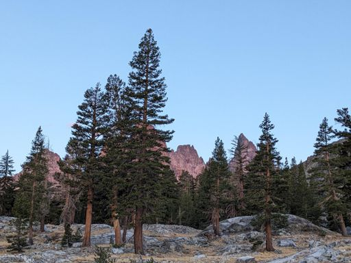
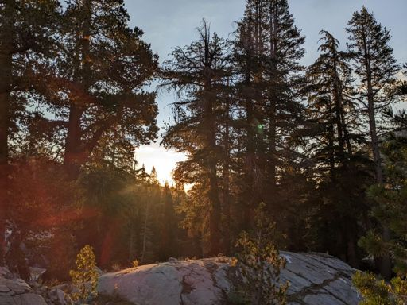
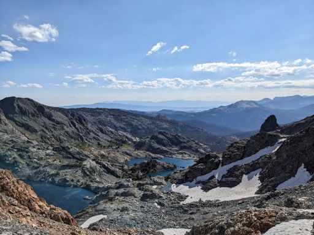
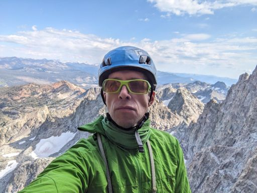

# Trip Report: Clyde Minaret (Southeast Face, Direct Start)
### Summary
 * **Date:** September 7, 2024
 * **Team:** Sergey & Vova
 * **Route:** Southeast Face (Direct Start)
 * **Style:** Car-to-Car
 * **Total Time:** 21:51:27
 * **Total Distance**: 22.21mi
 * **Total Elevation Gain**: 6,089ft
 * [Strava](https://www.strava.com/activities/12359210980)
 * [**GPX**](./Clyde_Minaret.gpx)

## 1. The Approach & Waiting at the Base

We set off from the parking lot at around **4:15 AM** under a dark sky, aiming to beat the heat and give ourselves a wide safety margin. The approach began mellow and fast along well-defined trails, but as we drew closer to the Minarets, the path deteriorated. The final segment of the approach was particularly confusing, with no clear trail through the talus and scree, requiring careful navigation. Overall, the approach took us about **5 hours**.

When we arrived at the base of the Southeast Face, we immediately spotted several other parties already on the route. While this made finding the start of the climb extremely straightforward, it also meant we had to queue. We ended up waiting at the base for at least an hour—possibly more—finally tying in and starting up the rock around **10:30 AM**.

## 2. Climbing, Dihedrals & Routefinding

The route began with the Direct Start, which delivered clean, enjoyable climbing. However, routefinding became noticeably trickier after Pitch 3, where the route traverses left. We struggled to locate the correct line initially, and even though there were other parties on the wall, they were hidden from view by the convoluted buttresses. 

Some of the dihedral pitches felt stiff and hard for the grade, requiring sustained effort. Once we cleared the dihedrals and established ourselves on the upper face, we caught up to a slower party moving ahead of us. Eager to make up time before sunset, we decided to pass them, merging pitches and simul-climbing right past them. The transition was fast, but it came at the cost of terrible rope drag as we pushed upward.

## 3. Summit & Exposed Raps
We topped out and summited Clyde Minaret around **6:30 PM**. The views across the Ansel Adams Wilderness were spectacular, but we couldn't linger. Knowing that the descent would be complex and dangerous in the dark, we hurried our transition and immediately began navigating the descent route.

Finding the rappel stations proved to be quite tricky. The route down the ridge is highly exposed, and route-finding requires making correct decisions at multiple exposed notches. Had we been forced to search for these anchors in the dark, it would have been significantly more difficult and hazardous. We managed to clear the rappels and retrieve our gear just as daylight faded.

## 4. Lost in the Dark (The Cecile Lake Mistake)

With headlamps on, we began the long hike back. Once we picked up our backpacks, we decided to try a different return path near **Cecile Lake** that was marked by stone cairns, hoping for a more direct route than our approach track. 

This turned out to be a major mistake. We lost the cairns almost immediately in the pitch black. We spent the next hour wandering in the dark, adding a full mile of frustrating retracing and route-finding through rugged terrain before we corrected course.

By the time we got back on the trail, physical exhaustion had set in. The final miles back to the car were a grind; our Strava splits show that during the descent, we were actually moving slower than we had on the uphill approach. We finally reached the car after **21 hours and 51 minutes** on the move—an exhausting but successful day in the Sierra.
