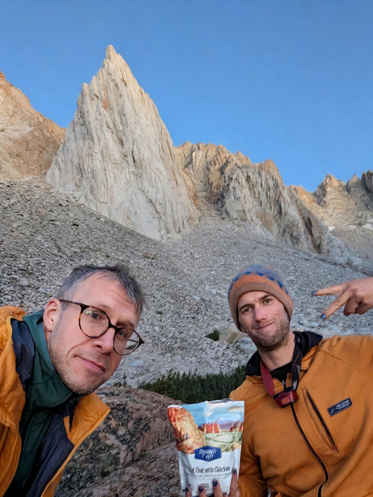
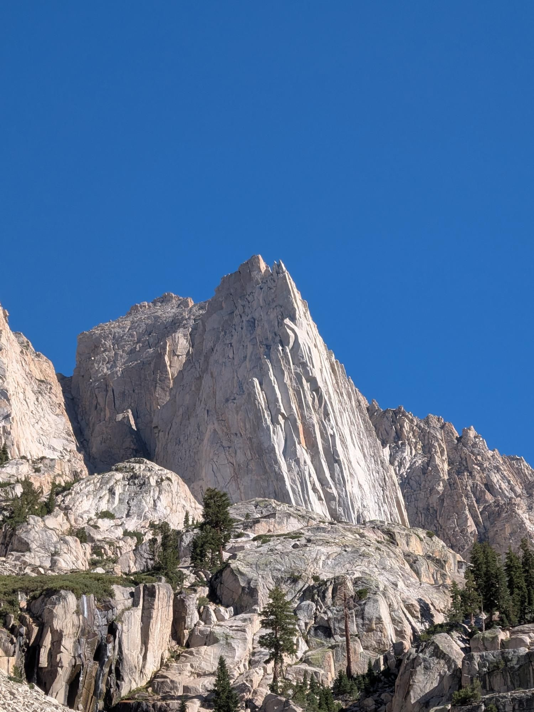
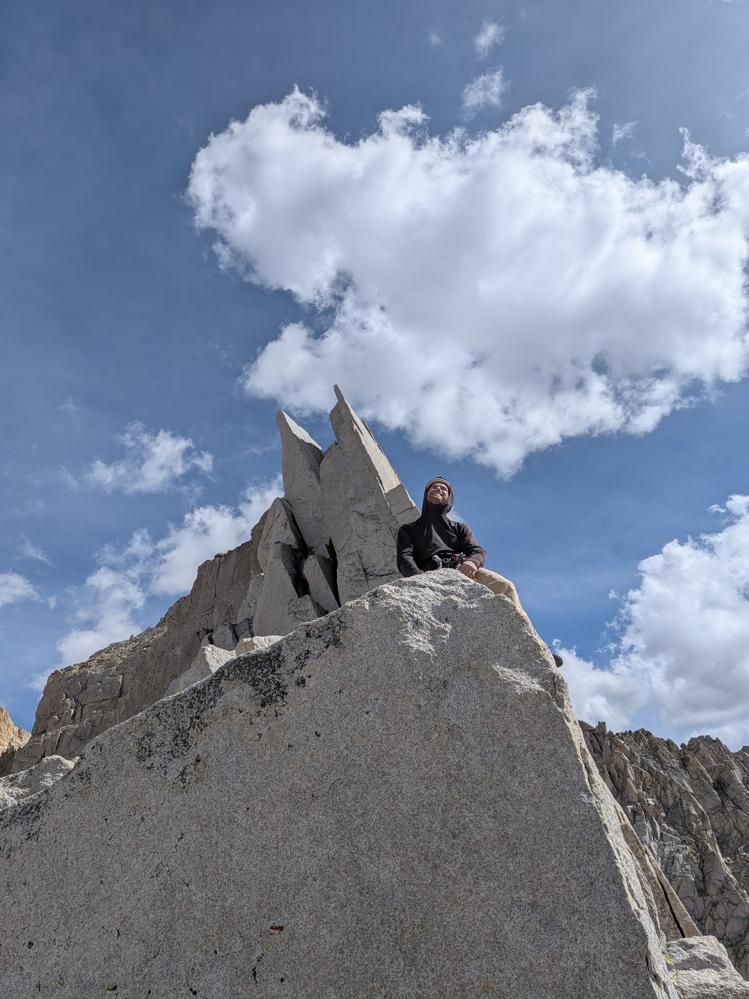

# Trip Report: Incredible Hulk (Positive Vibrations)
### Summary
 * **Date:** August 15–16, 2026
 * **Team:** Sergey & Peter
 * **Route:** Positive Vibrations (5.11a)
 * **Style:** Alpine Bivy (Base Cave)
 * **Total Time:** Day 1: 2:57:28 (Hike-In), Day 2: 10:00 (Climb & Rap) + 2:13:50 (Hike-Out)
 * **Total Distance**: ~9.6mi
 * **Total Elevation Gain**: ~3,800ft
 * [Strava (Hike-In)](https://www.strava.com/activities/19772814775)
 * [Strava (Hike-Out)](https://www.strava.com/activities/19774370701)
 * [**GPX**](./Hulk_hike_in.gpx)

## 1. Day 1: The Approach & The "Bivy Cave"

We hit the trail at **2:43 PM** under warm August skies. The hike in to the Incredible Hulk base took us **2 hours and 57 minutes** to cover **4.8 miles** and **2,635 feet** of elevation gain. 

Along the trail, we crossed paths with a ranger "trail ambassador" who gave us a friendly shaming for not bringing a bear canister. He also mentioned that another party was ahead of us planning to climb the exact same route. We joked that we might need to hold a push-up competition at the base to determine who gets to go first. Shortly after, we caught up to the team—Kyle and Eric from Redding. Seeing their physique, I quickly realized that a push-up competition was probably not one I was going to win!

When we arrived at the base of the Hulk, the bivy area was fairly crowded, but to our complete surprise, the famous bivy "cave" was completely unoccupied. It featured a perfectly flat, sandy floor—an ideal, cozy shelter for two. We set up camp, organized our climbing rack, and settled in for the night.

## 2. Day 2: The Climb (Positive Vibrations)

We woke up early and got ready faster than expected. Right outside our cave, we saw Kyle and Eric hiking past toward the base of the route. By the time we reached the base, they had already tied in and started Pitch 1. We waited about 30 minutes for them to gain distance and started climbing right at **7:00 AM**, sticking to our original target time.

* **Pitches 1–4 (Pitch Linking & Cold Fingers):** We decided to link Supertopo P1–2 and P3–4. Peter led the first block cleanly and quickly. Following him up, I struggled on the thin 5.10c crux—the morning shade was freezing cold, and with zero feeling in my fingers or toes, I slipped and blew the clean send. I took the lead for P3–4, which included the supposed first 5.11a crux. It felt much more reasonable (closer to 5.10b/c) and went smoothly, despite minor delays waiting for the party ahead.
* **Pitch 5 & The Windy Belay:** Peter cruised P5 up to the ledge. This belay proved to be the most uncomfortable of the entire climb—it was a tight ledge and the first spot on the face where biting alpine wind whipped through. We had a long wait here while Kyle led the crux pitch above, and I soon understood why when it became my turn to lead.
* **The Crux Pitch (Strenuous Corner to 5.11a Finish):** The pitch starts as a technical, thin corner requiring delicate gear placement, moves into an undercling roof traverse, punches over a rope-pinching bulge, and finishes up a thin 5.11a finger crack. Due to the bulge, I ended up with brutal rope drag near the top. As I made a move into the 5.11a finish, I fell, taking a substantial whip onto a blue Totem placed in a thin crack to the right of the main line. I rested and tried again, but fell a second time. Looking up, I asked Kyle at the belay above how he passed it—he admitted he aided through it without trying. I decided to follow suit; a purple Totem did the trick. Peter followed cleanly using a totally different technique—slapping the arête and stepping far left onto a face foothold that I hadn't even noticed.
* **Upper Pitches & Top-Out:** Peter led the next pitch, which looked easy on paper but surprised us with a tricky, reachy slab traverse. I took the final pitch—a beautiful crack line that would have been a highlight earlier in the day, but by now my feet were throbbing in climbing shoes, so I used every face foothold available to avoid twisting jams. Because our previous gear anchor consumed several hand-size pieces, I had to run out a significant portion of the pitch. We topped out at **3:00 PM** and built a gear anchor out of our remaining tiny pieces (.1, .3, .4 Totems/cams) right next to Kyle and Eric near the Venturi rap station.

## 3. The Rappels & Celebratory Burgers

After taking in the summit views, we began rapping down via the Venturi rappel line. With our 70m rope, distance was tight—one rappel barely reached the lower station. On the way down, we caught up with Kyle and Eric, who had gotten their rope stuck and landed at an upper rap station unable to reach the next anchor. We happily let them join and share our rope for the descent. 

Lower down, two pitches above the deck, we met Polish climber Stan and his partner climbing up. We fixed our rope, and Stan kindly agreed to pull and drop it for us once all four of us reached the ground. The rope snagged briefly when dropped, but close enough that I was able to scramble up in approach shoes to free it—an incredible relief to be out of tight climbing shoes! Touchdown at the base was **5:00 PM**.

We originally thought we might need a second bivy night, but with plenty of daylight remaining, we packed up our cave camp and began the hike out. We completed the return hike in **2 hours and 13 minutes**. Driving into Bridgeport around 9:00 PM, we were thrilled to find **Rhino's Bar & Grill** open and buzzing with live energy, pool games, and a full kitchen. We celebrated a successful trip with burgers and beers before heading home. I pulled into South Lake Tahoe just before midnight. Huge credit to Peter for being a fantastic partner on his first big Sierra alpine wall with me!

> **Takeaways for future parties:**
> * **Pitch Linking:** Linking the main crux pitch (P6–7) creates severe rope drag over the mid-pitch bulge; consider splitting it at the ledge below the 5.11a finish.
> * **Rack Management:** Save double hand-size pieces (.75–#2) for the final pitch so you don't run out after building a gear belay.
> * **Bivy Cave:** If available, the cave at the base of the Hulk offers premium, wind-protected flat bivy spots for two.
> * **Post-Climb Food:** Rhino's in Bridgeport keeps its kitchen open late and makes for the perfect post-Hulk celebration spot!
